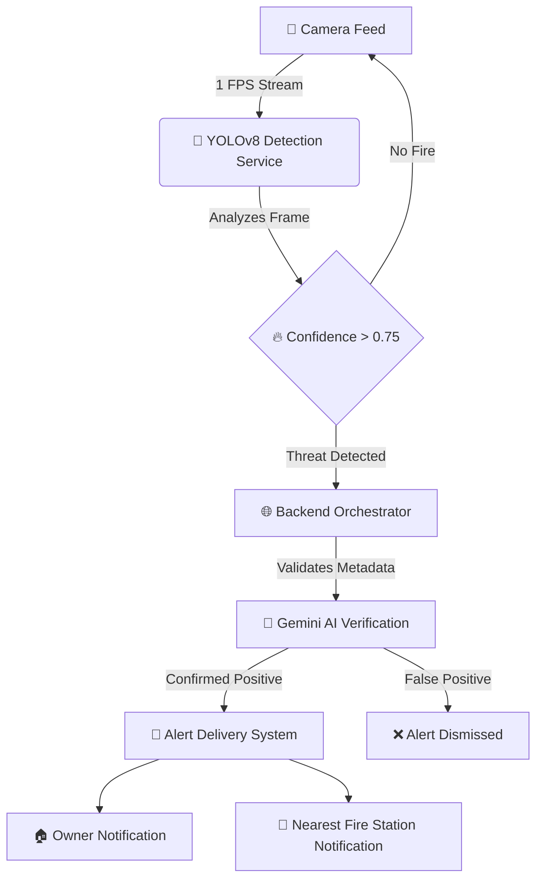

<!-- PROJECT LOGO -->

  

  <h1 align="center">AgniShakti</h1>

  

    <strong>AI-Powered Fire Detection & Emergency Response Ecosystem</strong>
     
    <em>"From detection → verification → action in seconds."</em>
     
     
    <a href="#-architecture">View Architecture</a>
    ·
    <a href="#-api-reference">Read API Docs</a>
    ·
    <a href="#-getting-started">Quick Start</a>
  

<!-- BADGES -->

  
  
  
  
  

 

## 🔥 Vision

**AgniShakti** is not just a fire detection system — it is an intelligent emergency response ecosystem designed to save lives, reduce damage, and enable real-time action using cutting-edge AI. Traditional smoke detectors trigger when it's often too late. AgniShakti leverages Computer Vision (**YOLOv8**) and **Google Gemini AI** to detect fire and smoke in real time from live camera feeds — and instantly alert the right people at the right time.

---

## ⚡ Key Highlights

### 🎥 Real-Time AI Detection
- **Zero-Latency Vision**: Custom-trained YOLOv8 model continuously monitors live CCTV / IP camera feeds.
- **High Precision**: Detects fire 🔥 & smoke 🌫️ instantly (> 0.75 confidence threshold).

### 🧠 AI Double Verification (Gemini AI)
- **Cognitive Filtering**: Every detection is re-validated using Google Gemini AI multimodal analysis.
- **Zero False Positives**: Significantly reduces false alarms (e.g., BBQ smoke, steam) ensuring alerts are accurate and trustworthy.

### 🚨 Smart Emergency Alerts
- **Instant Notifications**: Automated dispatch via email containing a detection snapshot 📸 and exact location details 📍.
- **Multi-Recipient**: Alerts are routed simultaneously to Property Owners and the nearest Fire Stations 🚒.

### 🗺️ Location-Based Fire Response
- **Hyper-Local Dispatch**: Dynamically calculates the Haversine Algorithm distance to pinpoint and notify the *absolute closest* emergency responder.

### ⏱️ Intelligent Alert Control
- 🕒 **30-Second Cancellation Window**: Allows human operators to abort false alarms before dispatch.
- 🔄 **10-Minute Cooldown System**: Prevents notification spam during active incidents.
- 🗑️ **Auto-Cleanup**: Automatically purges resolved alerts.

### 🏠 Multi-Property & Multi-Camera Support
- **Fleet Management**: Manage multiple properties from a single unified dashboard.
- **Infinite Feeds**: Each property supports multiple independent camera streams.

### 🔐 Role-Based Dashboards
- 👤 **Property Owner Dashboard**: Monitor live cameras and manage alerts.
- 🚒 **Fire Station Dashboard**: Receive nearby emergency alerts and respond faster.

---

## 🏗️ System Architecture

AgniShakti is built on a scalable, fail-safe microservice architecture:

 

### 1️⃣ AI Detection Service (FastAPI)
- Runs the local YOLOv8 model on port 8000.
- Processes live video frames and captures high-res incident snapshots.

### 2️⃣ AI Verification Layer (Gemini AI)
- Validates detected frames and filters false positives using advanced cognitive analysis.

### 3️⃣ Backend System (Next.js / Node)
- Handles authentication 🔐, Firebase transactions, alert orchestration, and the Nodemailer SMTP pipeline.

### 4️⃣ Frontend Dashboard (React)
- Modern UI/UX ⚡ with real-time monitoring and clean, role-based interfaces.

---

## 💡 Why AgniShakti?
✅ **Reduces response time drastically**  
✅ **Minimizes false alarms**  
✅ **Works in real-time**  
✅ **Scalable for Smart Cities 🏙️**  
✅ **Saves lives & property**

---

## 🚀 Future Enhancements
- 📱 **Mobile App Integration** for iOS / Android.
- 🔔 **Push Notifications** to supplement email alerts.
- ☁️ **Cloud Deployment** templates for AWS/GCP.
- 🤖 **Predictive Fire Risk Analysis** using historical data patterns.
- 🎯 **IoT Integration** with physical temperature and smoke sensors.

---

## 🏆 Impact & Vision
AgniShakti transforms traditional fire safety into an AI-driven, proactive system.

⏱️ Faster emergency response  
🧠 Smarter detection  
🌍 Scalable for real-world deployment  

### 👨‍💻 Team AgniShakti
*Built with passion, precision, and purpose ❤️*  
*To create technology that protects lives.*

---

**⭐ "AgniShakti is not just a project — it’s a step towards safer cities powered by AI." ⭐**

(<a href="#top">back to top</a>)

